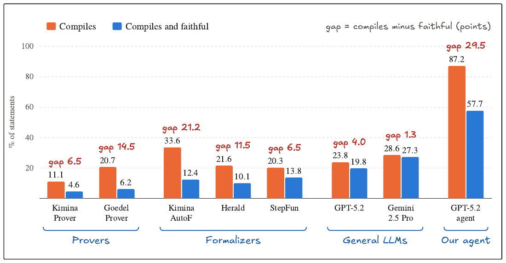

# Beyond Compilation

Code and data for **Beyond Compilation: Evaluating Faithful Natural-Language-to-Lean Statement Formalization** ([arXiv:2606.31002](https://arxiv.org/abs/2606.31002)).

A Lean declaration can compile while stating a different theorem from the one intended. We evaluate statement formalization without reference Lean targets. An output counts as **faithful** if it compiles in Lean 4 with Mathlib and both GPT-5.2 and Gemini-2.5-Pro grade it at least 9 out of 10. The paper studies two questions:

- **How far can this criterion be trusted?** On an independently audited random sample, it agrees with the human majority on 91.5% of cases. Humans confirm 95.7% of the outputs it accepts and 77–81% of the outputs it rejects.
- **How much does compilation overstate faithfulness?** The gap varies with the system: 1.3 percentage points for one-shot Gemini-2.5-Pro, and 29.5 points for a tool-augmented GPT-5.2 agent, which compiles 87.2% of statements but is faithful on 57.7%.



## Contents

| Path | Contents |
|---|---|
| `benchmark/benchmark.jsonl` | The 227 statements, each with its source textbook, repository commit, line number, and license. |
| `outputs/one_shot/` | Outputs of the seven one-shot systems and Sonnet 4.5 (one file per system). |
| `outputs/gpt52_agent/` | Outputs of the GPT-5.2 agent under all eight tool configurations (`config_TFS`). |
| `outputs/other_orchestrators/` | The full agent (config 111) with Sonnet 4.5 and Gemini-2.5-Pro as orchestrator. |
| `outputs/trajectories/` | Tool-call logs of every agent run. |
| `human_audits/` | Reviewer scores for the three audits: accepted outputs (Reviewer 1), rejected compiling outputs (Batch A), and Aristotle's outputs on a random sample (Batch B). |
| `checks/` | LeanScorer results on Batch B and BEq results on pairs of accepted outputs. |
| `analysis/` | `reproduce.py` recomputes every number in the paper from the files above; `figures/` redraws the figures. |
| `code/` | The agent, its tools and prompts, the judges, and the one-shot baselines. |

### Record formats

Each line of an `outputs/*.jsonl` file is one statement:

| Field | Meaning |
|---|---|
| `id` | Benchmark id (`BC001`–`BC227`), matching `benchmark/benchmark.jsonl`. |
| `lean_code` | The generated Lean file. |
| `compiles` | Whether it compiles in Lean 4 with Mathlib. |
| `gpt52_grade`, `gemini25pro_grade` | Judge grades from 0 to 10; −1 marks a failed call. |
| `gpt52_reason`, `gemini25pro_reason` | The judges' explanations. |
| `faithful` | The criterion: compiles and both grades ≥ 9. |
| `sonnet5_grade`, `sonnet5_reason` | Third-judge grade (agent configurations only). |
| `steps` | Number of agent steps (agents only). |
| `input_matches_benchmark` | False for 10 statements on which Kimina Prover, Kimina Autoformalizer and StepFun received another entry's text; these three systems are evaluated on the remaining 217. |

The human-audit files contain only scores. R1–R4 are anonymized reviewers, and `human_majority_faithful` follows the paper's rule: at least two scores, a majority of scores ≥ 9, and compile failures counted as unfaithful. Batch B includes the judge grades of Aristotle's outputs but not the outputs themselves. Case B-017 is Aristotle's output for a duplicate copy of statement BC100 that was collected under a different name; it is counted as the output for BC100.

## Reproducing the paper's numbers and figures

```bash
pip install -r analysis/requirements.txt
python analysis/reproduce.py           # writes analysis/results.json
python analysis/figures/fig_main_results.py docs/figure1.pdf
python analysis/figures/fig_multi_model.py figure5.pdf
python analysis/figures/fig_disagreement.py figure3.pdf
python analysis/figures/appendix_figs.py .
```

The `fig_*` scripts print an SVG to PDF with headless Chrome; set `CHROME` if Chrome is not at the default macOS path.

## Running the agent and the judges

The agent runs on a Lean REPL. Build [leanprover-community/repl](https://github.com/leanprover-community/repl) with the toolchain and Mathlib revision pinned in `code/lean/` (Lean `v4.22.0-rc4`, Mathlib `fc58204e`), then set:

```bash
export LEAN_REPL_DIR=/path/to/repl
export OPENAI_API_KEY=...          # GPT-5.2 orchestrator and judge
export GEMINI_API_KEY=...          # Gemini judge and orchestrator
export ANTHROPIC_API_KEY=...       # Sonnet orchestrator and third judge
export SERPER_API_KEY=...          # web search tool
export HERALD_API_URL=...          # OpenAI-compatible endpoint serving FrenzyMath/Herald_translator
```

```bash
cd code
pip install -r requirements.txt
python main.py default                         # full agent, config 111
python main.py T_0_F_1_S_1                     # other configurations; 000 is the one-shot GPT-5.2 baseline
python judge/judge_gpt.py results/config_default_results/agent_run_summary.csv
python judge/judge_gemini.py results/config_default_results/agent_run_summary.csv
```

The judges grade the summary CSV that `main.py` writes. The judge prompt is in the paper's appendix and in `code/judge/`.

## Citation

```bibtex
@article{zhang2026beyond,
  title   = {Beyond Compilation: Evaluating Faithful Natural-Language-to-Lean Statement Formalization},
  author  = {Zhang, Ke and Gallardo Candela, Patricio and Murthy, Sudhir and Xie, Yi and Wang, Zhi and Raissi, Maziar},
  journal = {arXiv preprint arXiv:2606.31002},
  year    = {2026}
}
```

## License

The code is released under the MIT License (`LICENSE`). The benchmark statements come from openly licensed textbooks and keep their sources' licenses; see `DATA_LICENSE.md`.
